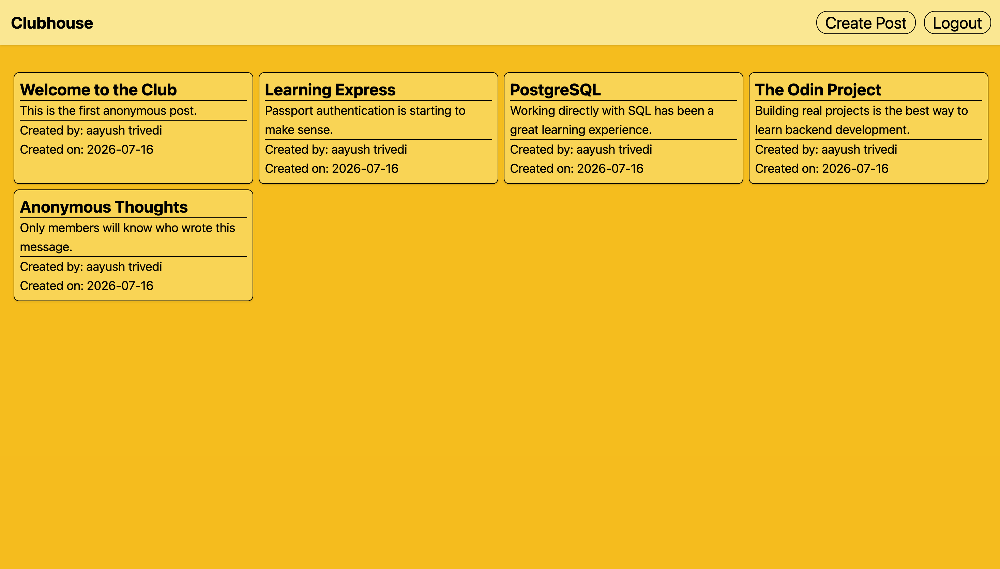
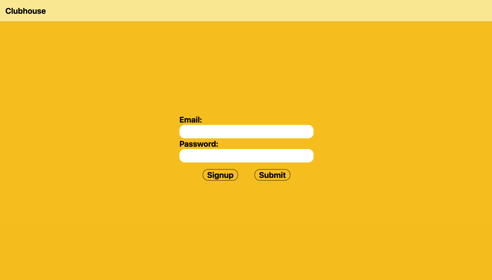
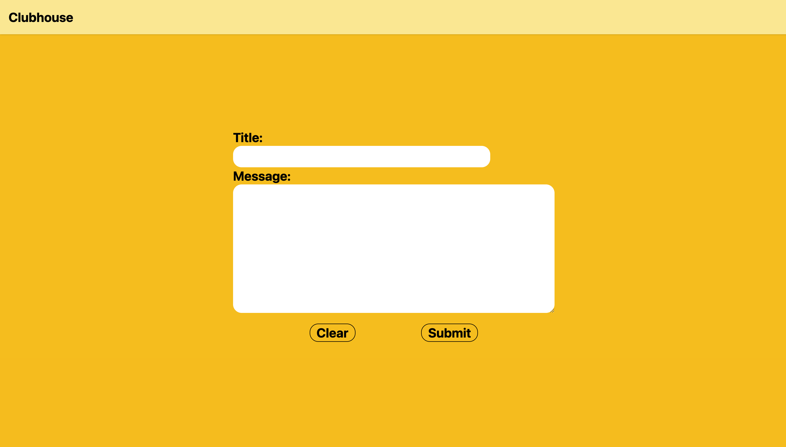
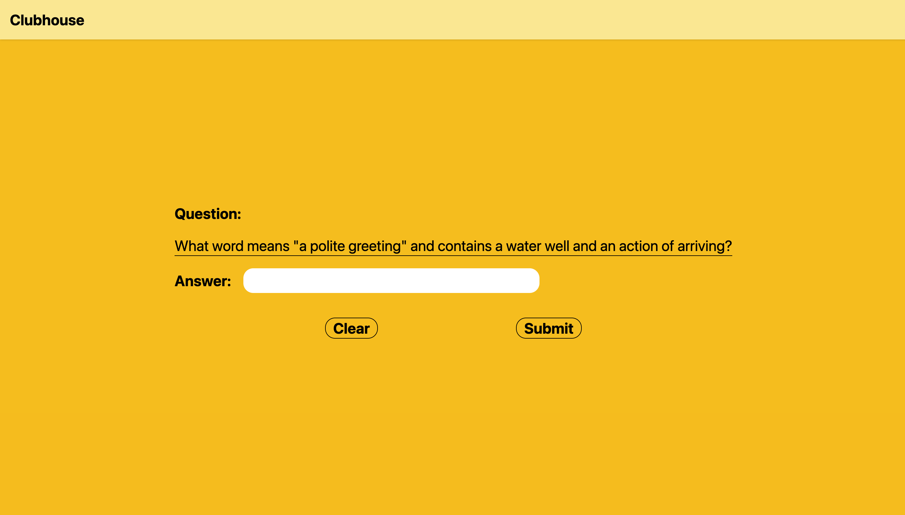

# Clubhouse


Clubhouse is a full-stack members-only message board inspired by anonymous club/forum projects. Visitors can read posts without seeing author details, authenticated users can create posts, and members/admins can see post authors and creation dates after joining the clubhouse with a secret code.

The project is organized as a monorepo with a React + TypeScript frontend and an Express + PostgreSQL backend.

**Project Status:** Finished portfolio project. Core authentication, membership, post visibility, post creation, and screenshot documentation are complete.

## Live Demo

**Live Application:** https://clubhouse-blush.vercel.app/

## Screenshots

| Homepage | Login |
| --- | --- |
|  |  |

| Create Post | Secret Question |
| --- | --- |
|  |  |

The app also includes a Lottie animation for the custom 404 page at `client/public/Error 404.lottie`.

## Highlights

- Session-based authentication using Passport Local
- Password hashing with bcrypt
- PostgreSQL-backed sessions using `connect-pg-simple`
- Anonymous public post feed for guests
- Member/admin post feed that reveals author and creation date
- Secret-code membership flow
- Protected post creation route
- Admin-only post deletion API route
- React Context state management for user and post data
- Form validation with `react-hook-form`
- Responsive Tailwind CSS layouts
- Custom 404 page using a Lottie animation

## Tech Stack

### Frontend

- React 19
- TypeScript 6
- Vite 8
- React Router
- React Context
- React Hook Form
- Axios
- Tailwind CSS 4
- LottieFiles DotLottie React
- ESLint

### Backend

- Node.js
- Express 5
- PostgreSQL
- `pg`
- Passport
- Passport Local
- Express Session
- Connect PG Simple
- bcrypt
- CORS
- Nodemon

### Database

- PostgreSQL users table
- PostgreSQL posts table
- UUID primary keys
- Foreign-key relationship from posts to users

## Repository Structure

```text
clubhouse/
├── client/                  # React + TypeScript frontend
│   ├── public/              # Public assets, including the 404 Lottie file
│   └── src/
│       ├── components/      # Reusable post card component
│       ├── context/         # User and posts context providers
│       ├── pages/           # Homepage, auth, post creation, secret-code, error pages
│       └── services/        # Axios API service functions
└── server/                  # Express + PostgreSQL backend
    ├── DB/                  # PostgreSQL connection, schema, seed data
    ├── controller/          # User and post request handlers
    ├── middleware/          # Passport and auth middleware
    ├── queries/             # SQL query modules
    └── routes/              # Express routers
```

## Architecture

```text
React Pages
   |
React Context Providers
   |
Axios Service Layer
   |
Express Routes
   |
Controllers
   |
SQL Query Modules
   |
PostgreSQL
```

Authentication uses server-side sessions. The frontend sends requests through Axios with `withCredentials: true`, and the backend uses Passport plus `express-session` to store authenticated users in PostgreSQL-backed sessions.

## Features

### Authentication

- User signup with email, first name, last name, and password
- Login using Passport Local with email as the username field
- Logout route that destroys the session and clears the session cookie
- Current-user restoration through `/api/users/me`
- Password hashing with bcrypt before storing users

### Authorization

- `requireAuth` middleware protects authenticated-only routes
- `requireAdmin` middleware protects admin-only routes
- Secret-code membership route updates `is_member` for the logged-in user
- Admin-only post deletion endpoint exists in the backend API

### Posts

- Public users can view post titles and text
- Members/admins can view post titles, text, author names, and creation dates
- Authenticated users can create posts
- Post creation validates title and message on the frontend and backend

### Forms and Validation

- Signup form validates required fields, email pattern, name length, and password strength
- Login form validates email and password requirements
- Create-post form validates required title/message fields
- Secret-code page validates that an answer was entered

### Error Handling

- API controllers return structured status codes for duplicate signup, invalid login, missing post fields, unauthorized access, and forbidden access
- Express includes a centralized error handler and a fallback 404 route
- Frontend pages show validation and submission error messages

## Frontend Routes

| Route | Description |
| --- | --- |
| `/` | Homepage with post grid |
| `/login` | Login form |
| `/signup` | Signup form |
| `/create-post` | Authenticated post creation page |
| `/secretpage` | Secret-code page for joining the clubhouse |
| `*` | 404 error page with Lottie animation |

## API Routes

### Users

| Method | Endpoint | Access | Description |
| --- | --- | --- | --- |
| `POST` | `/api/users/signup` | Public | Create a new user |
| `POST` | `/api/users/login` | Public | Login and create a session |
| `POST` | `/api/users/logout` | Authenticated session | Logout and destroy the session |
| `GET` | `/api/users/me` | Authenticated | Return the current session user |
| `POST` | `/api/users/join-club` | Authenticated | Validate the clubhouse code and set member status |

### Posts

| Method | Endpoint | Access | Description |
| --- | --- | --- | --- |
| `GET` | `/api/posts` | Public | Get all posts, with author metadata only for members/admins |
| `GET` | `/api/posts/:id` | Public | Get one post, with author metadata only for members/admins |
| `POST` | `/api/posts` | Authenticated | Create a post |
| `DELETE` | `/api/posts/:id` | Admin | Delete a post |

## Database Schema

### `users`

- `id` UUID primary key
- `first_name`
- `last_name`
- `email` unique
- `password`
- `is_member`
- `is_admin`

### `posts`

- `id` UUID primary key
- `title`
- `text`
- `created_by`
- `created_at`

The `posts.created_by` column references `users.id`.

## Environment Variables

Create a `.env` file in the `server/` directory.

```env
PORT=3000
ORIGIN=http://localhost:5173
SESSION_SECRET=your-session-secret
CLUBHOUSE_CODE=your-secret-code
user=your-postgres-user
password=your-postgres-password
host=localhost
database=clubhouse
NODE_ENV=development
```

The frontend currently uses this API base URL in `client/src/services/api.ts`:

```ts
baseURL: 'http://localhost:3000/api'
```

## Getting Started

### 1. Install dependencies

```bash
cd server
npm install

cd ../client
npm install
```

### 2. Create the database

Create a PostgreSQL database, then run the schema file:

```bash
psql -d clubhouse -f server/DB/schema.sql
```

Optional seed data is available in:

```bash
server/DB/seed.sql
```

### 3. Start the backend

```bash
cd server
npm start
```

The backend runs on `http://localhost:3000` by default.

### 4. Start the frontend

```bash
cd client
npm run dev
```

The frontend runs on the Vite dev server, usually `http://localhost:5173`.

## Available Scripts

### Client

```bash
npm run dev
npm run build
npm run lint
npm run preview
```

### Server

```bash
npm start
npm test
```

`npm test` is currently a placeholder script in the server package.

## Implementation Notes

- `PostProvider` fetches posts on mount and exposes `refreshPosts` plus `createPost`.
- `UserProvider` restores the current user on load, manages login/logout/signup, and refreshes posts when auth state changes.
- Guest users receive post data without `first_name`, `last_name`, or `created_at`.
- Members/admins receive post data joined with author and timestamp fields.
- `connect-pg-simple` can create the session table automatically through `createTableIfMissing: true`.
- CORS is configured with `process.env.ORIGIN` and `credentials: true`.

## Project Status

This project is complete as a portfolio-ready full-stack application. The core flow is implemented: users can sign up, log in, create posts, join the clubhouse with a secret code, and view expanded post metadata after becoming members.

## Future Improvements

- Move the frontend API base URL into an environment variable for easier deployment.
- Add a frontend admin dashboard for the existing admin-only post deletion API.
- Add automated tests for authentication, membership, and post visibility.
- Add pagination or infinite scroll for larger post feeds.
- Adjust the seed file so sample posts do not depend on a hardcoded user UUID.

## License

This project is licensed under the MIT License.
